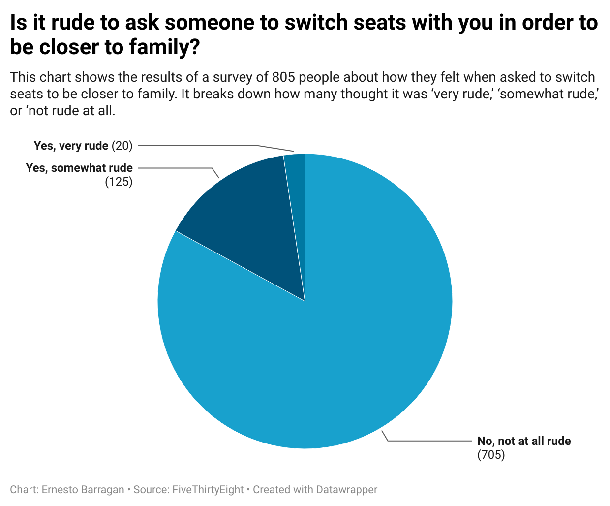

# FiveThirtyEight

I chose this question to determine if people find it rude to ask others on a plane if they can switch seats to allow families to sit together.  Considering the fact that the data set provided was on flight etiquette, we also consider that many airlines allow you to pay extra for a seat, so I thought it would be interesting to see how people reacted to asking to switch seats.

*The result was shocking, as a vast majority of people did not find it rude to ask to switch seats.*
